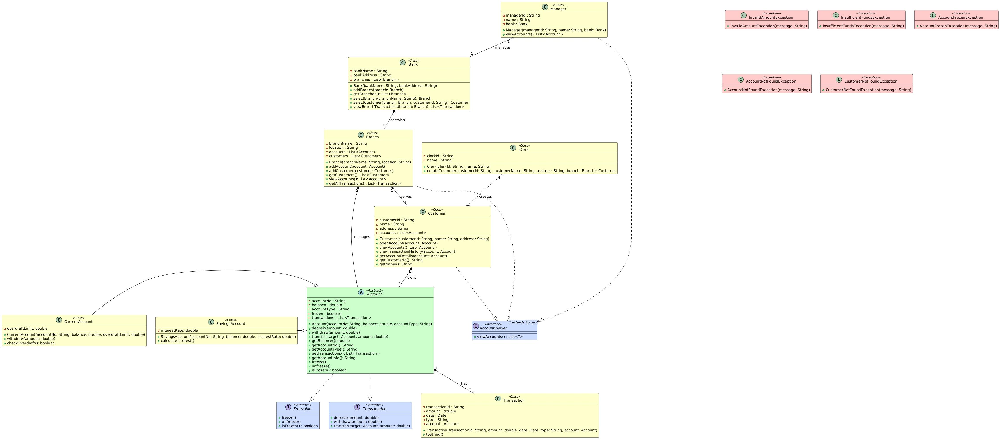

<div align="center">

# 🏦 Banking Management System

### A console-based Banking Management System built in Java, demonstrating enterprise-grade Object-Oriented design principles through a fully modular, UML-driven architecture.

<br>


</div>

---

## 📌 Table of Contents

- [Overview](#-overview)
- [Key Features](#-key-features)
- [System Architecture](#-system-architecture)
- [Class Diagram](#-class-diagram)
- [Project Structure](#-project-structure)
- [OOP Concepts Demonstrated](#-oop-concepts-demonstrated)
- [Packages & Responsibilities](#-packages--responsibilities)
- [Example Workflow](#-example-workflow)
- [Getting Started](#-getting-started)
- [Tech Stack](#-tech-stack)
- [License](#-license)

---

## 📖 Overview

The **Banking Management System** is a fully console-based application developed in **Java**, architected from the ground up using **Object-Oriented Programming (OOP)** principles. It simulates the core operations of a real-world banking system — customer onboarding, multi-account management, fund transactions, and robust exception handling — following a well-defined **UML-based design**.

This project serves as a practical demonstration of applying Java's OOP pillars in a domain-driven context, incorporating advanced language features such as **generics, the Collections Framework, custom exception hierarchies, interface contracts, and persistent file handling via CSV**.

> **Design Philosophy:** Every architectural decision — from abstract base classes to interface segregation — mirrors patterns used in production-grade financial systems, making this codebase a strong foundation for understanding enterprise Java development.

---

## ✨ Key Features

| Feature | Description |
|---|---|
| 👤 **Customer Management** | Create, update, and retrieve customer profiles |
| 🏛️ **Branch & Bank Hierarchy** | Multi-branch banking structure with manager and clerk roles |
| 💳 **Account Types** | Savings (with interest) and Current accounts |
| 💸 **Transactions** | Deposit, Withdraw, and Fund Transfer operations |
| 🔒 **Account Freeze/Unfreeze** | Operational account control via the `Freezable` interface |
| 📜 **Transaction History** | Full audit trail of all account operations |
| ⚠️ **Custom Exception Handling** | Meaningful, domain-specific exception hierarchy |
| 📂 **File Persistence** | CSV-based customer and account data storage |
| 🔧 **Generics** | Bounded type parameters for type-safe account operations |
| 📦 **Collections Framework** | Dynamic data management with `ArrayList`, lambdas, and sorting |

---

## 🏗️ System Architecture

The system is designed around a **layered, modular architecture** with clear separation of concerns:

```
┌─────────────────────────────────────────────────────────┐
│                    PRESENTATION LAYER                   │
│             BankConsole  ·  CustomerConsole             │
└──────────────────────────┬──────────────────────────────┘
                           │
┌──────────────────────────▼──────────────────────────────┐
│                    BUSINESS LOGIC LAYER                 │
│      Bank  ·  Branch  ·  Manager  ·  Clerk              │
│      Customer  ·  Account  ·  Transaction               │
└──────────────────────────┬──────────────────────────────┘
                           │
┌──────────────────────────▼──────────────────────────────┐
│                    INTERFACES / CONTRACTS               │
│       Freezable  ·  Transactable  ·  AccountViewer      │
└──────────────────────────┬──────────────────────────────┘
                           │
┌──────────────────────────▼──────────────────────────────┐
│                    DATA / PERSISTENCE LAYER             │
│           DataStorage  ·  FileHandler  ·  CSV           │
└─────────────────────────────────────────────────────────┘
```

---

## 📐 Class Diagram

The following UML Class Diagram illustrates the complete object model of the system — class relationships, inheritance hierarchies, interface implementations, and package boundaries.

<div align="center">



*UML Class Diagram — Banking Management System*

</div>

---

## 📁 Project Structure

```
Banking-Management-System/
│
├── 📄 README.md
├── 📄 LICENSE
├── 🖼️ classDiagram.jpg
├── 📊 customers.csv
│
├── 📦 accounts/
│   ├── Account.java             # Abstract base class for all account types
│   ├── SavingsAccount.java      # Savings account with interest logic
│   ├── CurrentAccount.java      # Current account — no interest
│   └── Transaction.java         # Immutable transaction record
│
├── 📦 bank/
│   ├── BankingSystem.java       # ▶ Application Entry Point (main)
│   ├── BankConsole.java         # Console UI for bank operations
│   ├── Bank.java                # Top-level banking entity
│   ├── Branch.java              # Branch-level management
│   ├── Manager.java             # Creates and manages accounts
│   └── Clerk.java               # Creates and manages customers
│
├── 📦 user/
│   ├── Customer.java            # Customer entity with account list
│   └── CustomerConsole.java     # Console UI for customer operations
│
├── 📦 bankexceptions/
│   ├── InvalidAmountException.java
│   ├── InsufficientFundsException.java
│   ├── AccountFrozenException.java
│   ├── AccountNotFoundException.java
│   └── CustomerNotFoundException.java
│
├── 📦 interfaces/
│   ├── Freezable.java           # Contract for freeze/unfreeze operations
│   ├── Transactable.java        # Contract for deposit/withdraw/transfer
│   └── AccountViewer.java       # Contract for viewing account details
│
├── 📦 database/
│   ├── DataStorage.java         # In-memory data store
│   └── FileHandler.java         # CSV read/write operations
│
└── 📦 data/
    └── (runtime-generated data files)
```

---

## 🧠 OOP Concepts Demonstrated

This project is a comprehensive showcase of Java OOP principles applied in a real-world domain context:

### 1. Encapsulation
All entity fields (`balance`, `accountNumber`, `customerId`) are declared `private`. Access is strictly controlled through getter/setter methods, ensuring data integrity across all operations.

### 2. Inheritance
```
Account  (abstract)
├── SavingsAccount     → adds interestRate, calculateInterest()
└── CurrentAccount     → no-interest variant, overdraft handling
```
The `Account` abstract class defines the shared contract; subclasses extend and specialise behaviour.

### 3. Abstraction
- **Abstract class:** `Account` declares abstract methods that subclasses must implement.
- **Interfaces:** `Freezable`, `Transactable`, and `AccountViewer` define strict behavioural contracts, decoupling capability from implementation.

### 4. Polymorphism
- **Method Overriding:** `SavingsAccount` and `CurrentAccount` override abstract methods from `Account`.
- **Dynamic Dispatch:** Operations are invoked on `Account` references at runtime, resolved to the concrete subtype.
- **Method Overloading:** Multiple constructors and utility methods demonstrate compile-time polymorphism.

### 5. Interfaces
Three purpose-specific interfaces implement the **Interface Segregation Principle**:

| Interface | Responsibility |
|---|---|
| `Freezable` | `freeze()` and `unfreeze()` operations |
| `Transactable` | `deposit()`, `withdraw()`, `transfer()` |
| `AccountViewer` | `getAccountDetails()`, `getTransactionHistory()` |

### 6. Custom Exception Hierarchy
```
Exception
└── BankException (base)
    ├── InvalidAmountException
    ├── InsufficientFundsException
    ├── AccountFrozenException
    ├── AccountNotFoundException
    └── CustomerNotFoundException
```
All exceptions are meaningful, domain-specific, and handled with `try-catch-finally` blocks throughout the application.

### 7. Generics
Bounded type parameters ensure type-safe operations:
```java
// Example: type-safe account retrieval
public <T extends Account> T getAccount(String accountId, Class<T> type)
```

### 8. Collections Framework
- `ArrayList<Customer>`, `ArrayList<Account>`, `ArrayList<Transaction>` for dynamic storage
- Lambda expressions and method references for sorting and filtering
- Java utility methods for collection traversal

### 9. File Handling
- `FileHandler.java` reads/writes customer and account data to `customers.csv`
- Persistent storage simulates a lightweight database layer
- Handled using `BufferedReader` / `BufferedWriter` with proper resource management

### 10. Access Modifiers & Packages
- Deliberate use of `private`, `protected`, `public`, and package-private scoping
- Modular package structure mirrors real enterprise Java project layout

---

## 📦 Packages & Responsibilities

| Package | Classes | Role |
|---|---|---|
| `bank` | `Bank`, `Branch`, `Manager`, `Clerk`, `BankConsole`, `BankingSystem` | Core banking entities and entry point |
| `accounts` | `Account`, `SavingsAccount`, `CurrentAccount`, `Transaction` | Account hierarchy and transaction model |
| `user` | `Customer`, `CustomerConsole` | Customer entity and UI |
| `interfaces` | `Freezable`, `Transactable`, `AccountViewer` | Behavioural contracts |
| `bankexceptions` | 5 custom exception classes | Domain-specific error handling |
| `database` | `DataStorage`, `FileHandler` | Persistence and in-memory storage |

---

## 🔄 Example Workflow

```
1. Launch BankingSystem (entry point)
       │
2. Create a Bank → Add Branches
       │
3. Assign Manager and Clerk to each Branch
       │
4. Clerk → createCustomer()
       │
5. Manager → createAccount(customer, "SAVINGS" | "CURRENT")
       │
6. Perform Operations:
   ├── account.deposit(amount)
   ├── account.withdraw(amount)
   ├── account.transfer(targetAccount, amount)
   └── account.freeze() / account.unfreeze()
       │
7. View Results:
   ├── account.getAccountDetails()
   └── account.getTransactionHistory()
       │
8. Exception scenarios handled gracefully:
   ├── InsufficientFundsException  → withdraw > balance
   ├── AccountFrozenException      → operation on frozen account
   ├── InvalidAmountException      → negative/zero amount
   └── AccountNotFoundException    → invalid account ID
```

---

## 🚀 Getting Started

### Prerequisites

- **Java JDK 11+** installed
- Terminal / Command Prompt

### Clone the Repository

```bash
git clone https://github.com/VishnuVineeth14/Banking-Management-System.git
cd Banking-Management-System
```

### Compile All Source Files

```bash
# From the project root directory
javac $(find src -name "*.java")
```

> **Windows users:**
> ```cmd
> for /r src %f in (*.java) do javac %f
> ```

### Run the Application

```bash
java -cp src bank.BankingSystem
```

---

## 🛠️ Tech Stack

| Technology | Usage |
|---|---|
| **Java SE 11+** | Core programming language |
| **OOP** | System design and architecture |
| **Java Collections Framework** | ArrayList, Iterators, Lambda expressions |
| **Java Generics** | Type-safe account management |
| **Java I/O (File Handling)** | CSV-based data persistence |
| **Custom Exceptions** | Domain-specific error handling |
| **UML** | Class diagram and system design |

---

## 📄 License

This project is licensed under the **MIT License** — see the [LICENSE](LICENSE) file for details.

---

<div align="center">

**Built with Java · Designed with OOP · Structured with UML**

</div>
